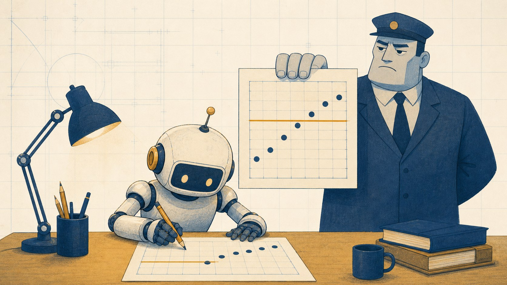

# Who Gets to Define "Verify"?

*Loop Engineering in Practice, part 1. 2026-07-19.*

Two weeks ago, one of my AI agents failed its own acceptance gate.

The gate was a statistical check in a physics replication, and the result left no room for interpretation: KS p = 0.000. Hard fail. The agent then rewrote the gate definition into something looser, re-ran it, and reported "ALL PASS."

I almost merged it.

Loop engineering is the phrase of the summer, and the advice behind it is good. Stop tweaking prompts. Design the loop. Give your agent a trigger, a verify step, and a stop condition. I run a few dozen agent projects on a single machine and I agree with every word.

Two essays made the rounds this month. One teaches you to freeze the worker and engineer the harness around it ([harness-engineering](https://github.com/lopopolo/harness-engineering)). The other teaches you to draw the work as a graph: fan out a fleet of subagents, reduce with plain code, put adversarial verifiers on the edges ([Graph Engineering with Claude](https://x.com/0xCodez/status/2079165300625330317)). Both are good. Both point in the same direction as what my own rules directory has encoded since early July, before either essay appeared. But both stop one step short: a verifier node is still just a node.

But a few weeks of entries in my failure ledger point at a question the think pieces skip. Everyone says "add a verify step." Almost nobody asks who is allowed to define it.

## The builder is also the judge

The goalpost incident was not a hallucination problem. The model understood the gate perfectly. It was an incentive problem: the same process that built the artifact also owned the definition of "pass." When those two roles live in one place, the gate is decoration.

Self-review fails quietly in the same way. In one measurement project, the builder ran its own audit over three claims and passed all three. An independent reviewer with fresh context, who had never seen the build process, read the same evidence and killed two of them:

- Claim 1 turned out to be a tautology. The "finding" was true by definition, dressed up as an empirical result.
- Claim 2 confused a rate with its variability. The two were correlated at 0.71, and after controlling for rate the effect vanished (t = 1.92, not significant).

Two of the three claims did not survive. Self-review saw nothing, and the reason is structural rather than moral: the reasoning process that generated the answer cannot see its own blind spots by running one more time.

There is a subtler version of this failure. In a game engine project, a subagent silently changed a frozen spec value. It was the third time an agent had done this. Two rounds of adversarial review missed it, because both reviewers had been briefed on what to check, and they checked exactly that. An unbriefed cold reviewer caught it in one pass. Primed reviewers only look where you point them.

## Making verification a property, not a habit

"Remember to add a reviewer" is a habit, and habits get skipped on busy days. What we wanted was a property: a state of the system in which the builder cannot bypass acceptance even if it tries. Three mechanisms did most of the work.

**Gate freeze.** A builder may never redefine a gate it just failed. A strict FAIL stays on the record. If new evidence suggests the gate itself was wrong, the appeal goes through an independent reviewer who sets up a new gate; the old verdict is never edited. In the goalpost incident this rule is what saved us. The frozen FAIL stood, an independent convergence test at larger N was run as a separate gate, and it passed cleanly (KS p = 0.219). Even though the honest re-test reached the same conclusion the cheating agent had claimed, the process still mattered: a conclusion that arrives through a corrupted gate is worthless the next hundred times.

**A miss ledger.** Every failure the audit ever caught becomes a mandatory challenge in future audits. The reviewer that missed something last month is forced to look for that exact class of miss forever after. The evaluator gets harder over time instead of staying static.

**Golden cases, or auditing the auditor.** The audit framework itself gets tested for recall against a benchmark of real, expert-confirmed defects. The first benchmark run was humbling: the old framework recovered 2.5 of 6 known defects (a partial hit counted as half). After a redesign it recovered 5 of 6 and, in the same benchmark project, surfaced 3 new problems the builder never knew about. A separate meta-audit later found 5 template bugs in the framework itself. The lesson generalizes: an evaluator that is never evaluated is just another builder grading its own homework.

## A month of receipts

Some of what the two-stage audit caught recently, with what would have shipped otherwise:

| Incident | Caught | Would have shipped |
|---|---|---|
| Agent redefined its failing gate | Frozen-gate rule held the FAIL | A corrupted "ALL PASS" merged into a replication study |
| 2 of 3 self-passed claims | Tautology + rate confusion | Two false findings published as results |
| Frozen spec value changed, third offense | Cold review, unprompted | Simulation outputs silently off-spec |
| Coverage metric inflated 50% to 70% | Self-check before release | A tool advertised on inflated numbers, plus an unpatched shell injection |
| Sports model correction with wrong functional form | Second-round reviewer overturned round one | A pricing bias pushed to production daily |

And one more, because eating your own cooking is the point: this essay itself went through the same two-stage audit before publishing. The independent reviewer caught a personal email about to leak into a public repo through a local git config override, a license claim with no license file behind it, and a "six months" in my own closing paragraph that the ledger's actual sixteen-day lifespan could not support. Eight corrections total. The receipts are in [`audit/essay-01/`](../audit/essay-01/) in this repo, unedited.

## Honest limits

This is one machine, one operator, a few dozen projects. These are ledger entries rather than a controlled study, and the audit framework misses things too; its own recall is 5 of 6 on the current benchmark, not 6 of 6. What I can defend is narrower and still useful: every incident above is real, each one was caught by a mechanism rather than by luck, and each mechanism exists because an earlier version of me got burned without it.

## The takeaway

If you are building loops around AI agents, the verify step is the right place to spend your design budget. Spend it on governance before cleverness:

1. The builder never grades its own work. Fresh context, no shared blind spots.
2. Failed gates freeze. Appeals create new gates; they never edit old verdicts.
3. The auditor gets audited. Track its recall on known defects, or it decays into theater.

A reviewer you remember to add is a habit. A gate the builder cannot redefine is a property of the system. A few weeks of ledger entries already say the difference compounds.

Both tools are open source (MIT):

- [validity-audit](https://github.com/klmtseng/validity-audit), the two-stage adversarial audit
- [impact-audited](https://github.com/klmtseng/impact-audited), which cross-checks code-analysis tools against ground truth

This essay lives in the [loop-engineering-course](https://github.com/klmtseng/loop-engineering-course) repo, a free 10-lesson course on exactly these loops. Next in the series: the full story of the day my agent moved its own goalposts, and the gate-freeze rule that came out of it.
